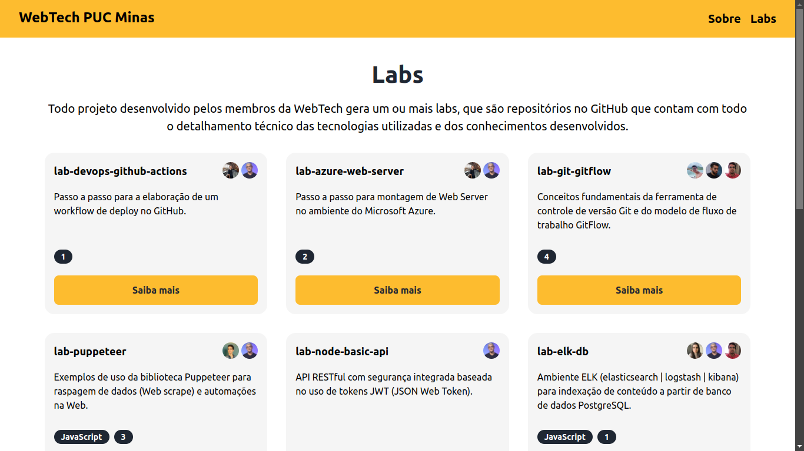

<!-- Exemplo de uso do template: https://github.com/kspencerl/lab-springboot-basic-api -->

# React.js

Construção de uma página com a biblioteca React.js.

## Tecnologias utilizadas
Linguagens, Frameworks e Bibliotecas utilizadas na construção do projeto.

<!-- Link com os badges para inserir abaixo https://devicon.dev/ -->
<div style="display: flex; gap: 10px;">
  
  
  
</div>

## Onde Aplicar
Este projeto pode ser aplicado em diversas situações:
- Desenvolvimento de **sites** e aplicações **web**.
- Desenvolvimento de **componentes** reutilizáveis.
- **Integrações** com back-end.
- Construções de **dashboards**.

# Sumário

* [História do Desenvolvimento Front-End](#história-do-desenvolvimento-front-end)
* [O que é o React?](#o-que-é-o-react)
* [Introdução ao Lab](#introdução-ao-lab)
* [Step 1 - SetUp](#step-1---setup)
* [Step 2 - Entendendo o JSX](#step-2---entendendo-o-jsx)
* [Step 3 - Componentes e Props](#step-3---componentes-e-props)
  * [Hora de Praticar 01](#-hora-de-praticar-01)
* [Step 4 - Rotas](#step-5---rotas)
  * [Hora de Praticar 02](#-hora-de-praticar-02)
* [Step 5 - Estados](#step-4---estados)
  * [Hora de Praticar 03](#-hora-de-praticar-03)
* [Boas práticas](#boas-práticas)
* [Novas tendências em React e Front-End](#novas-tendências-em-react-e-front-end)


## História do Desenvolvimento Front-End

O desenvolvimento front-end passou por várias fases, marcadas pelo uso de diferentes ferramentas. Três tecnologias se destacaram ao longo dessa jornada:

- HTML
- CSS
- JavaScript

### 🌐 O início:
No início, cada nova página de um site precisava de um código específico para cada funcionalidade. Isso significava:
- **Trabalho excessivo:** Repetição de tarefas já feitas.
- **Códigos mais pesados:** Muitos dados duplicados.


### 🚀 A Solução: Bibliotecas e Frameworks
Para resolver esses problemas, surgiram bibliotecas e frameworks que facilitaram a vida dos desenvolvedores. Um destaque é o React.js:
- Uma biblioteca JavaScript para criar aplicações front-end **dinâmicas e eficientes**.

### ✅ Benefícios do React.js
1. **Reutilização de Componentes:** Crie componentes reutilizáveis, economizando tempo e esforço.
2. **Virtual DOM:** Melhora a performance ao atualizar apenas os componentes necessários.
3. **Comunidade Ativa:** Suporte constante e muitas bibliotecas adicionais.


## O que é o React?

React é uma biblioteca em JavaScript desenvolvida pelo Facebook, projetada para otimizar tarefas simultâneas, como chats, status e conversas online. Essas operações são comuns em aplicações do Facebook.

### 🎯 Objetivo do React

O React visa criar **pequenas partes** individuais de uma tela, como:
- Botões
- Cards
- Rodapés
- Imagens

Isso resulta em uma aplicação que funciona de maneira independente, permitindo que cada "pequena parte" ou ``componente`` possa realizar suas próprias ações sem depender do resto da página. Seus benefícios são: 

1. **Reutilização:** Crie uma vez, use em qualquer lugar.
2. **Manutenção Facilitada:** Atualize componentes sem afetar o restante da aplicação.
3. **Desempenho Aprimorado:** Atualize apenas os componentes necessários.

### 🔍 Exemplo Prático: Web-Tech

Para entender melhor, observe a página do site Web-Tech abaixo:
Na página, você pode ver como os ``componentes`` individuais (botões, cards) são utilizados para criar uma interface dinâmica e eficiente.


Observa-se que em cada retângulo vermelho temos uma parte, ou seção do site. Nessas regiões, notamos pequenas partes que realizam funções semelhantes, chamadas componentes.

### 🧩 O Poder dos Componentes
Os componentes são semelhantes na construção e design, diferenciando-se principalmente pelas informações que contêm.

### 🚫 Método Tradicional: HTML e CSS
Se quiséssemos construir essa página apenas com HTML e CSS, precisaríamos duplicar o mesmo código HTML várias vezes para obter o resultado desejado. Isso resultaria em:

- **Redundância:** Código duplicado
- **Manutenção difícil:** Alterações em várias partes

### ✅ Método Moderno: React
Com ferramentas como o **React**, não precisamos duplicar código e as alterações ficam centralizadas em um único componente. Vejamos um exemplo prático:
**Exemplo: Navbar**

**Sem** o uso de bibliotecas:
- Teríamos que inserir um código de navbar em cada nova página criada.

**Com** o uso do React:
- Podemos chamar a navbar uma única vez e aplicá-la em todas as páginas.


Nos retângulos azuis, podemos ver a mesma **navbar** em duas páginas diferentes. Em uma aplicação simples com HTML e CSS, precisaríamos duplicar esse código, mas com a biblioteca React poderíamos ter somente um ``componente``. Isso é um pouco da grandeza do React.js, e é isso que iremos explorar no nosso lab.


## Introdução ao Lab

Nesse lab você irá aprender os principais conceitos para a criação de uma aplicação completa com a biblioteca React.js. Vamos abordar a construção do site da Web-Tech, disponível no **[link](https://webtech.network/)**, utilizando também conceitos como requisições em API!

### 🔍 Comparando React com códigos em HTML/JS:

#### HTML/JS

```html
<nav class="navbar">
    <a href="#" class="logo">Logo</a>
    <ul class="nav-links">
        <li><a href="#">Home</a></li>
        <li><a href="#">About</a></li>
        <li><a href="#">Services</a></li>
        <li><a href="#">Contact</a></li>
    </ul>
    <button class="nav-toggle" id="navToggle">Menu</button>
</nav>
```
#### React/JSX

```jsx
import React, { useState } from 'react';
import './Navbar.css';

const Navbar = () => {
  const [isOpen, setIsOpen] = useState(false);

  const toggleNav = () => {
    setIsOpen(!isOpen);
  };

  return (
    <nav className="navbar">
      <a href="#" className="logo">Logo</a>
      <ul className={`nav-links ${isOpen ? 'active' : ''}`}>
        <li><a href="#">Home</a></li>
        <li><a href="#">About</a></li>
        <li><a href="#">Services</a></li>
        <li><a href="#">Contact</a></li>
      </ul>
      <button className="nav-toggle" onClick={toggleNav}>Menu</button>
    </nav>
  );
};

export default Navbar;
```

### ⭕ Similaridades:

- **Estrutura e Estilização:** Ambos usam HTML (ou JSX) para estrutura e CSS para estilização.

### ❌ Diferenças:

- Integração do JavaScript:
  - **HTML:** O JavaScript é separado do HTML e funciona de forma independente.
  - **React:** O JavaScript funciona integrado ao HTML por meio do JSX, uma extensão da sintaxe HTML dentro do JavaScript.

- Modularidade:
  - **HTML/CSS/JavaScript:** Não é modular. O código precisa ser duplicado sempre que usado em diferentes páginas.
  - **React:** Altamente modular. A navbar é um componente reutilizável que pode ser importado em qualquer parte da aplicação.

### 🚀 Conclusão da Comparação:
Iniciar com React é fácil, já que  é uma evolução natural para quem já conhece JavaScript e HTML. Ele combina ambas tecnologias para criar componentes reutilizáveis, dando facilidade na construção e manutenção de interfaces complexas. Assim, vamos iniciar nosso projeto dando um setup na aplicação!


## Step 1 - SetUp
 
### 1️. Instalando o Node.js e npm:

Primeiro, você precisa instalar o Node.js, que inclui o npm (Node Package Manager), essencial para gerenciar pacotes de software para Node.js. Baixe o instalador do Node.js no site oficial **[nodejs.org](nodejs.org)** e siga as instruções de instalação.

### 2️. Verificando instalação
Verifique se o Node.js e o npm foram instalados corretamente executando os seguintes comandos no terminal:

```sh
node -v
npm -v
```

### 3️. Instalando ‘create-react-app’

``create-react-app`` é uma ferramenta oficial para criar rapidamente aplicações React com uma configuração inicial padrão. No terminal rode o seguinte comando:

```sh
npm install -g create-react-app
```

### 4️. Criando seu primeiro projeto em React:
Para iniciar um novo projeto React, vamos usar a ferramenta Create React App, que configura automaticamente a estrutura inicial do projeto, incluindo todas as dependências necessárias.

```sh
npx create-react-app web_tech_page
```

### 5️. Estrutura do Projeto:

Depois de criar o projeto, a estrutura de diretórios será a seguinte:

```
web_tech_page/
├── public/
├── src/
│   ├── App.js
│   ├── index.js
├── package.json
├── README.md
└── .gitignore
```

- ``public/``: Contém arquivos estáticos públicos.
- ``src/``: Contém os arquivos de código-fonte.
- ``App.js``: Componente principal da aplicação.
- ``index.js``: Ponto de entrada da aplicação.


### 6. Executando o projeto:
Navegue até a pasta do projeto e execute o seguinte comando para seu projeto ser iniciado. 

```sh
npm start
```
Se tudo estiver certo, será iniciado na sua máquina um novo endereço http://localhost:3000/, dando acesso a sua mais nova aplicação. Pronto! Com isso podemos dar início a criação do nosso primeiro projeto em React. 


## Step 2 - Entendendo o JSX

JSX é uma extensão de sintaxe para JavaScript que permite escrever HTML dentro de arquivos JavaScript. É utilizado para descrever como a interface de usuário deve ser renderizada.

### 🧩 Exemplo simples de um código JSX:

```jsx
// src/components/HelloWorld.js
import React from 'react';

const HelloWorld = () => {
    return (
        <div>
            <h1>Hello, World!</h1>
        </div>
    );
};

export default HelloWorld;
```

### 🌐 Como o navegador interpreta um código JSX?
Um navegador interpreta a princípio três linguagens principais:

- **HTML (HyperText Markup Language)**: linguagem padrão para estruturar e apresentar informações na web.
- **CSS (Cascading Style Sheets)**: responsável por estilizar o conteúdo HTML, inserindo cores, formatos e animações nas aplicações.
- **Javascript**: linguagem de programação responsável por adicionar 

É fato que posteriormente surgiram diversas outras ferramentas e tecnologias as quais transformaram o uso dessas linguagens, necessitando de maneiras para serem utilizadas pelos navegadores. Com o JSX o código é transpilado/ compilado para JavaScript por meio de ferramentas como Babel e WebPack. 


### ▶ Retorno de funções React.js

Por padrão, o código JSX é retornado como uma função, chamada createElement que possibilita a interpretação para códigos JavaScript. Ela possui três parâmetros principais, sendo eles:
- **type**: tipo da função podendo ser uma tag HTML ou outro componente React.
- **props**: atributos desejáveis no componente
- **children**: parte que contém conteúdo HTML ou outros componentes


## Step 3 - Componentes e Props

### 📦 Componentes:
- Componentes são blocos reutilizáveis de código que permitem criar interfaces de usuário complexas a partir de pequenas partes isoladas.

```jsx
// src/components/Header.js
import React from 'react';

const Header = () => (
    <header>
        <h1>WebTech PUC Minas</h1>
        <nav>
            <ul>
                <li>Sobre</li>
                <li>Labs</li>
                <li>Eventos</li>
                <li>Equipe</li>
                <li>Contato</li>
            </ul>
        </nav>
    </header>
);

export default Header;
```

### 🔧 Props:
Props são argumentos passados para componentes React que permitem personalizar e reutilizar componentes.

```jsx
import React from 'react';

const Saudacao = (props) => {
  return <h1>Olá, {props.nome}!</h1>;
};

export default Saudacao;
```
Você pode usar este componente passando diferentes valores para a prop ``nome``:

```jsx
<Saudacao nome="Maria" />
<Saudacao nome="João" />
```

### 👨‍🏫 Hora de Praticar 01

Vamos iniciar a criação dos nossos primeiros componentes em React.js, o Navbar e Footer. Nessa seção você irá aprender sobre os Links, que são muito similares com as tags <a> usadas em HTML. Eles se diferem dessas tags por não necessitarem recarregar a página quando acontece o clique sobre eles. Siga as instruções abaixo para a realização: 

- Vá para a pasta ``src`` e crie uma nova pasta chamada ``components``

- Dentro de components crie uma nova pasta chamada ``layout``

- Em ``layout``crie um arquivo nomeado de ``Navbar.js``

- No arquivo digite o código abaixo:

```jsx
// src/components/layout/Navbar.js
import React from 'react';
import { Link } from 'react-router-dom'
import styles from './Navbar.module.css'

const Navbar = () => (
    <header className={styles.navbar}>
        <h1><Link to="/">WebTech PUC Minas</Link></h1>
        <nav>
            <ul>
                <li><Link to="/">Home</Link></li>
                <li><Link to="/labs">Labs</Link></li>
            </ul>
        </nav>
    </header>
);

export default Navbar;
```

##### Utilize o CSS: ``Navbar.module.css``

## Step 4 - Rotas 

### 🛣️ Rotas:
No React, usamos bibliotecas como ``react-router-dom`` para gerenciar a navegação entre diferentes páginas ou componentes. ``react-router-dom`` fornece componentes como ``Router``, ``Route``, ``Switch`` e ``Link`` para configurar as rotas da aplicação.


### 📝 Exemplo de configuração de rotas:

```jsx
import React from 'react';
import { BrowserRouter as Router, Route, Switch } from 'react-router-dom';
import Home from './Home';
import About from './About';

const App = () => {
  return (
    <Router>
      <Switch>
        <Route exact path="/" component={Home} />
        <Route path="/about" component={About} />
      </Switch>
    </Router>
  );
};

export default App;
```

### Detalhes sobre ``react-router-dom``:

- BrowserRouter:
  - ``BrowserRouter`` é o componente principal que envolve toda a aplicação.
  - Controla a sincronização do URL com a interface do usuário.
- Route:
  - Define uma rota e o componente que será renderizado quando o URL corresponder ao caminho especificado.
  - O atributo `path` define o caminho da URL, enquanto element recebe o componente a ser renderizado.
  - Diferente da versão anterior, não é mais necessário o `prop exact` porque a correspondência é exata por padrão.
- Switch:
  - Renderiza exclusivamente a primeira rota filha que corresponde ao caminho atual.
  - Evita que múltiplas rotas sejam renderizadas ao mesmo tempo.
- Link:
  - Usado para criar links de navegação que modificam o URL sem recarregar a página.
  - Substitui o uso de ``<a>`` para navegação interna.

### 👨‍🏫 Hora de Praticar 02

Agora iremos dar inicio ao nosso projeto criando o arquivo que será responsável por chamar todos os outros, o ``App.js``. Nele iremos chamar nosso componente ``Navbar`` e utilizar o nosso conhecimento sobre rotas. Siga as instruções abaixo para a realização: 

- Vá para a pasta ``src``

- Encontre um arquivo chamado ``App.js``

- Reescreva sobre o antigo código o código abaixo:


```jsx
// src/App.js
import { BrowserRouter as Router, Route, Routes } from 'react-router-dom';

import Home from "./components/pages/Home"
import Navbar from './components/layout/Navbar';
import Footer from './components/layout/Footer';
import Labs from './components/pages/Labs';


function App() {
  return (
    <Router>
      <Navbar />
      <div>
        <Routes>
          <Route exact path="/" Component={Home} />
          <Route exact path="/labs" Component={Labs} />
        </Routes>
      </div>
      <Footer/>
    </Router>
  );
}

export default App;
```

- Posteriormente, vá para ``src/components``

- Crie uma pasta chamada ``pages``

- Dentro de ``pages`` crie um arquivo chamado ``Home.js``

- Insira o código abaixo:


```jsx
// src/components/pages/Home.js
import styles from './Home.module.css'

function Home() {
  return (
    <div className={styles.home_page}>
      <h1>Bem vindo, a <span>WebTech!</span></h1>
    </div>
  );
}

export default Home;
```

##### Utilize o CSS: ``Home.module.css``

## Step 5 - Estados 

### 📊 Estados:
Estados são objetos que armazenam dados dinâmicos e podem mudar ao longo do tempo, permitindo que os componentes React sejam interativos e **reativos** a mudanças.

### 📝 Exemplo de componente com estado (usando hooks):

```jsx
import React, { useState } from 'react';

const Contador = () => {
  const [contador, setContador] = useState(0);

  return (
    <div>
      <p>Contagem: {contador}</p>
      <button onClick={() => setContador(contador + 1)}>Incrementar</button>
    </div>
  );
};

export default Contador;
```

### Como os estados funcionam:
- Definição do Estado Inicial:
  - Usamos ``useState`` para definir o estado inicial.
  - ``useState`` retorna um array com dois elementos: o valor atual do estado e uma função para atualizar o estado.

```jsx
const [contador, setContador] = useState(0);
```

- Atualização do Estado:
  - Usamos a função ``setContador`` para atualizar o estado.
  - Quando o estado é atualizado, o componente é re-renderizado para refletir as mudanças.

```jsx
<button onClick={() => setContador(contador + 1)}>Incrementar</button>
```

### 👨‍🏫 Hora de Praticar 03

Nesta tarefa, vamos integrar uma API externa do GitHub para obter dados sobre os Labs da organização WebTech. Utilizaremos uma variedade de componentes e técnicas de controle de estado que aprendemos neste laboratório. Siga os passos abaixo para concluir a tarefa com sucesso:

- Vá em ``src/components/pages``

- Crie um arquivo ``Labs.js``

- Dentro de ``Labs.js``insira o código abaixo:

```jsx
// src/components/pages/Labs.js
import React, { useEffect, useState } from 'react';
import LabCard from '../layout/LabCard';
import styles from './Lab.module.css'


function Labs() {
    const [repos, setRepos] = useState([]);
    const githubUsername = 'WebTech-PUC-Minas';

    useEffect(() => {
        async function fetchData() {
            try {
                // Consultar os repositórios do usuário
                const reposResponse = await fetch(`https://api.github.com/users/WebTech-PUC-Minas/repos`);
                const reposData = await reposResponse.json();


                // Informações de cada contribuidor
                const reposWithContributors = await Promise.all(
                    reposData.map(async (repo) => {
                        const contributorsResponse = await fetch(repo.contributors_url);
                        const contributorsData = await contributorsResponse.json();
                        return { ...repo, contributors: contributorsData };
                    })
                );


                // Filtra somente os labs
                const filteredRepos = reposWithContributors
                    .filter((repo) => repo.name.startsWith('lab-'))
                    .sort((a, b) => new Date(b.updated_at) - new Date(a.updated_at));

                setRepos(filteredRepos);
            } catch (error) {
                console.error('Erro ao buscar dados do GitHub:', error);
            }
        }

        fetchData();
    }, [githubUsername]);

    return (
        <div className={styles.lab_page}>
            <section>
                <h1>Labs</h1>
                <p className={styles.description}>Todo projeto desenvolvido pelos membros da WebTech gera um ou mais labs, que são repositórios no GitHub que contam com todo o detalhamento técnico das tecnologias utilizadas e dos conhecimentos desenvolvidos.</p>
                <div className={styles.grid}>
                    {repos.map((repo) => (
                        <LabCard key={repo.id} repo={repo} />
                    ))}
                </div>
                <div className={styles.grid}>
                </div>
            </section>
        </div>
    );
}

export default Labs;
```
##### Utilize o CSS: ``Labs.module.css``

Nesta página, buscamos informações do perfil GitHub da WebTech, filtrando especificamente os repositórios que são identificados como "labs". Além disso, coletamos dados sobre os contribuidores de cada projeto, destacando quem contribuiu para cada lab.

Note que estamos utilizando um componente que ainda não foi criado no projeto, o ``LabCard``. Esse componente será responsável por exibir as informações de cada repositório em um formato de card. A seguir, vamos criar o LabCard:

- Vá em ``src/components/layout``

- Crie um arquivo chamado ``LabCard.js``

- Nesse arquivo insira o código abaixo:

```jsx
// src/components/layout/LabCard.js
import LabLabel from './LabLabel';
import LabContributor from './LabContributor';
import styles from './LabCard.module.css';

function LabCard({ repo }) {
    return (
        <div className={styles.lab_card}>
            <div>
                <div className={styles.card_top}>
                    <h5>{repo.name}</h5>
                    <div className={styles.contributors}>
                        {repo.contributors.slice(0, 3).map((contributor) => (
                            <LabContributor key={contributor.id} contributor={contributor} />
                        ))}
                    </div>
                </div>
                <p>{repo.description}</p>
            </div>
            <div className={styles.card_footer}>
                <div className={styles.labels}>
                    {repo.language && <LabLabel>{repo.language}</LabLabel>}
                    {repo.stargazers_count > 0 && <LabLabel> {repo.stargazers_count}</LabLabel>}
                </div>
                {/* <ButtonLink text="Saiba mais" link={repo.html_url} />*/}
                <div>
                    <a href={repo.html_url}>Saiba mais</a>
                </div>
            </div>
        </div>
        
    );
}

export default LabCard;
```

##### Utilize o CSS: ``LabCard.module.css``


Esse código exibe as informações de cada repositório, recebendo o próprio repositório como parâmetro. Ele organiza os dados nos locais apropriados e faz uso de dois componentes adicionais: ``LabContributor`` e ``LabLabel``.

A seguir, vamos criar o primeiro componente, o ``LabContributor``:

- Navegue até ``src/components/layout``.

- Crie um arquivo chamado ``LabContributor.js``.

- Insira o seguinte código:

```jsx
// src/components/layout/LabContributor.js
import styles from './LabContributor.module.css'

function LabContributor({ contributor }) {
  return (
    <div className={styles.lab_contributor}>
      <a href={contributor.html_url} target="_blank" rel="noopener noreferrer">
        
      </a>
    </div>
  );
}

export default LabContributor;
```

##### Utilize o CSS: ``LabContributor.module.css``


O código recebe o contribuidor associado e exibe suas informações básicas. Em seguida, vamos criar o componente ``LabLabel``:

- Vá para ``src/components/layout``

- Crie um arquivo chamado ``LabLabel.js``

- Insira o código abaixo:

```jsx
// src/components/layout/LabLabel.js
import styles from './LabLabel.module.css'

function LabLabel({ children }) {
    return (
        <div className={styles.lab_label}>{children}</div>
    );
}

export default LabLabel;
```

##### Utilize o CSS: ``LabLabel.module.css``

Com isso, concluímos a criação da nossa primeira página em React, aplicando conceitos fundamentais como rotas, JSX, componentes, props e estados. 

Explore mais desta tecnologia incrível, experimentando com novos conceitos e criando páginas adicionais semelhantes às da WebTech. Ao concluir o projeto, sua página deve se assemelhar ao exemplo mostrado abaixo. Acesse o site da **[WebTech](https://webtech.network/)** e tente replicar mais páginas para aprimorar ainda mais suas habilidades!



##### Explore os arquivos desse repositório e insira componentes como ``Footer.js``


## Boas práticas

- Organização de Componentes
  - **Componentes Pequenos e Reutilizáveis:** Divida sua aplicação em componentes pequenos, independentes e reutilizáveis.
  - **Pastas por Funcionalidade:** Organize os arquivos do projeto por funcionalidade em vez de tipo de arquivo (ex: ``components/Button.js`` em vez de ``components/Buttons/Button.js``).

- Estado e Props
  - **Gerenciamento de Estado:** Use hooks como ``useState`` e ``useReducer`` para gerenciar o estado local dos componentes.
  - **Lift State Up:** Eleve o estado para o componente mais próximo comum quando necessário compartilhar dados entre componentes.
  - **Prop-Types:** Utilize ``PropTypes`` para documentar e validar os tipos de props que um componente deve receber.

```jsx
import PropTypes from 'prop-types';

const Saudacao = ({ nome }) => {
  return <h1>Olá, {nome}!</h1>;
};

Saudacao.propTypes = {
  nome: PropTypes.string.isRequired,
};
```

- Hooks
  - **useEffect**: Utilize useEffect para efeitos colaterais, mas certifique-se de limpar os efeitos, se necessário, para evitar vazamentos de memória.
  - **Custom Hooks**: Crie hooks personalizados para encapsular a lógica reutilizável.

#### Use Effect
```jsx
import React, { useEffect } from 'react';

const ComponenteFuncional = () => {
useEffect(() => {
  // Código para buscar dados ou configurar assinaturas

  return () => {
    // Código para limpar assinaturas
  };
}, []);

return <div>Olá, eu sou um componente funcional!</div>;
};

export default ComponenteFuncional;
```

#### Custom Hooks
```jsx
import { useState, useEffect } from 'react';

const useFetch = (url) => {
  const [data, setData] = useState(null);
  const [loading, setLoading] = useState(true);

  useEffect(() => {
    fetch(url)
      .then((response) => response.json())
      .then((data) => {
        setData(data);
        setLoading(false);
      });
  }, [url]);

  return { data, loading };
};

export default useFetch;
```

- Estilização
  - **CSS Modules:** Use CSS Modules para escopo local de estilos e evitar conflitos de nomes.

```jsx
/* Button.module.css */
.button {
   background-color: blue;
   color: white;
 }

import styles from './Button.module.css';
```

## Novas tendências em React e Front-End

React, a popular biblioteca para construção de interfaces de usuário, está sempre evoluindo para atender às necessidades crescentes dos desenvolvedores e das aplicações modernas. Aqui estão algumas das principais tendências e inovações em React que estão moldando o futuro do desenvolvimento web:

### 1. Suspense e Concurrent Mode

O React Suspense e o Concurrent Mode são duas das principais inovações para melhorar a performance e a experiência do usuário. O Suspense permite que você defina quais partes da interface podem ser renderizadas de forma assíncrona, enquanto o Concurrent Mode permite que o React interaja com a UI de forma mais fluida e responsiva, evitando bloqueios e melhorando a experiência geral.

### 2. React Server Components

Os React Server Components são uma nova forma de renderizar componentes no servidor, que permite construir aplicações mais rápidas e eficientes. Eles ajudam a otimizar o carregamento inicial da página, reduzindo a quantidade de JavaScript enviado ao cliente e melhorando o desempenho geral.

### 3. Hooks Avançados

Os Hooks continuam a ser uma tendência significativa, com novos hooks sendo adicionados e mais práticas recomendadas surgindo. Hooks como useMemo, useCallback, e useReducer têm se mostrado essenciais para gerenciar estados e efeitos em componentes funcionais, enquanto novos hooks personalizados oferecem soluções específicas para problemas comuns.

### 4. Web Vitals e Performance
A medição e otimização dos Web Vitals, como tempo de carregamento, interatividade e estabilidade visual, estão se tornando essenciais. O React está se ajustando para oferecer melhores práticas e ferramentas para monitorar e melhorar esses aspectos críticos da performance.

### 5. TypeScript e Tipagem Estática

A integração com TypeScript está se tornando cada vez mais comum, proporcionando uma tipagem estática robusta para aplicações React. Isso ajuda a reduzir erros e melhora a manutenção do código, especialmente em projetos grandes e complexos.

### 6. Design Systems e Component Libraries
O uso de sistemas de design e bibliotecas de componentes (como Material-UI, Ant Design e Chakra UI) está crescendo, permitindo a criação de interfaces consistentes e reutilizáveis com maior eficiência.

### 7. Automação e Ferramentas de Desenvolvimento
A automação de tarefas e a integração contínua (CI) estão se tornando padrão em projetos React. Ferramentas como Jest para testes, ESLint para linting, e Prettier para formatação de código são cada vez mais integradas para garantir a qualidade e a consistência do código.

### 8. Otimização com React Query e SWR
Ferramentas como React Query e SWR estão ganhando popularidade para gerenciamento e cache de dados. Elas facilitam a busca, o cache e a sincronização de dados com o servidor, melhorando a eficiência das aplicações e simplificando o gerenciamento de estado.

### 9. Next.js e Frameworks de Renderização
Frameworks como Next.js continuam a ser amplamente utilizados em conjunto com React para fornecer renderização no servidor (SSR), geração de sites estáticos (SSG) e outras funcionalidades avançadas. Esses frameworks ajudam a melhorar o desempenho, SEO e a experiência do desenvolvedor.

Para isso, produzimos outro lab essencial para quem deseja explorar sobre front-end, explicando um pouco mais de Next.js. Entre no **[link](https://github.com/WebTech-PUC-Minas/lab-next-js)** e aprenda sobre Next.js!!

<br/>

Essas tendências estão moldando o futuro do desenvolvimento com React, ajudando os desenvolvedores a criar aplicações mais rápidas, escaláveis e eficientes. Ficar atualizado com essas tendências pode oferecer uma vantagem significativa na construção de aplicações modernas e de alta qualidade.

## Contato

Mariana Almeida - [marianaalmeidafga@gmail.com](mailto:marianaalmeidafga@gmail.com).<br>
GitHub: [github.com/marialmeida1](https://github.com/marialmeida1).

Nilson Deon Cordeiro Filho - [nilsondeon01@gmail.com](mailto:nilsondeon01@gmail.com@gmail.com).<br>
GitHub: [github.com/NilsonDeon](https://github.com/NilsonDeon).

## License

Este projeto é licenciado sob a [Nome da Licença](URL da Licença) - veja o arquivo [LICENSE.md](LICENSE.md) para mais detalhes.

